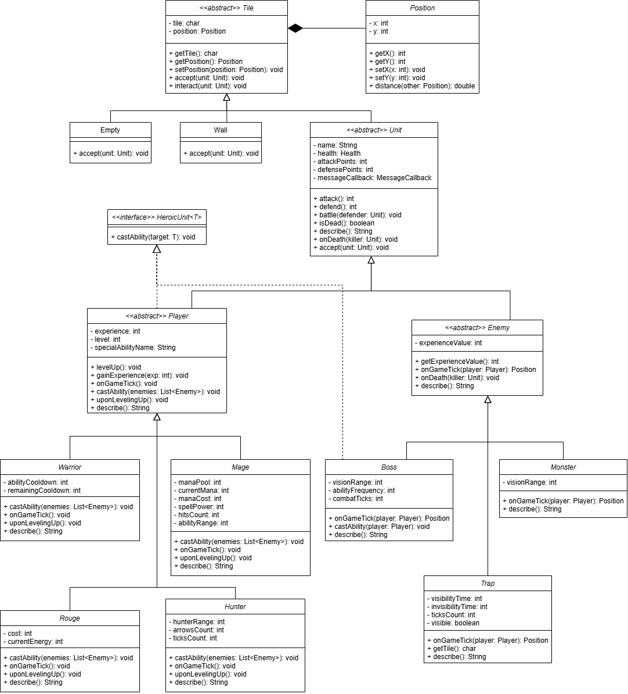

# Dungeons and Dragons


---

## Introduction

My version of Dungeons and Dragons is a single-player multi-level dungeon crawler game developed in Java.

The project was built as part of an Object-Oriented Programming course at Ben-Gurion University and focuses on applying core software engineering principles such as inheritance, polymorphism, abstraction, encapsulation, design patterns such as the Observer and Visitor patterns, and clean class design.

The project also includes a graphical user interface (GUI) built using Java Swing.

---

## Gameplay

In the game, the player explores dangerous dungeon levels filled with enemies, traps, and obstacles.  
The objective is to defeat all enemies on each level and progress through the dungeon until the final level is completed.  
The player can move around the board, attack enemies, and use unique special abilities depending on the selected character.

### Controls

| Key | Action               |
| --- | -------------------- |
| `W` | Move Up              |
| `A` | Move Left            |
| `S` | Move Down            |
| `D` | Move Right           |
| `E` | Cast Special Ability |
| `Q` | Wait / Skip Turn     |

### Game Rules

- Walls/bushes block movement.
- Enemy units also block movement.
- Moving into an enemy tile initiates combat.
- Enemies move and attack during their turns.
- Defeating enemies grants experience points.
- Gaining enough experience levels up the player and improves stats.
- Each player class has a unique special ability.
- The game ends when the player dies or completes all dungeon levels.

---

## Project Structure



---

## Getting Started

### Clone the repository

```bash
git clone https://github.com/morshay1/dungeons-and-dragons.git
```

### Open the project

Open the project in:

- IntelliJ IDEA
- VS Code
- Eclipse
- or any Java IDE

### Run the game

Run the `Main` class.

---

## Learning Goals

This project was created to practice and demonstrate:

- Java programming
- Object-Oriented Programming
- Design Patterns (Visitor Pattern, Observer Pattern)
- Software architecture and design
- Java Swing GUI development
- Clean code practices
- Large multi-class project organization

---

## Future Improvements

Possible future extensions for the project:

- Multiplayer support
- Network/server-based gameplay
- Save/load game functionality
- Concurrency and multithreading optimizations for game systems

---

## Contribution

This project was developed by Mor Shay.  
Illustrations were drawn by Yaal Hans Shapira.
