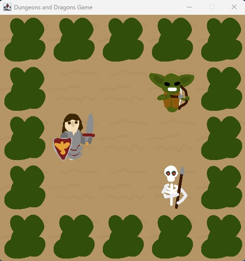

# Dungeons and Dragons



## Introduction
Dungeons and Dragons is a single-player multi-level dungeon crawler game developed in Java.  
The project was built as part of an Object-Oriented Programming course and focuses on applying core software engineering principles such as inheritance, polymorphism, abstraction, encapsulation, and clean class design.

In the game, the player explores dangerous dungeon levels filled with enemies, traps, and obstacles.  
The objective is to survive battles, defeat all enemies on each level, and progress through the dungeon until the final level is completed.

The project also includes a graphical user interface (GUI) implementation using Java Swing.

---

## Project Structure - UML Diagram


---

## Getting Started

### Clone the repository

```bash
git clone https://github.com/morshay1/dungeons-and-dragons.git
```

### Open the project

Open the project in:
- IntelliJ IDEA
- VS Code
- Eclipse
- or any Java IDE

### Run the game

Run the `Main` class.

---

## Future Improvements

Possible future extensions for the project:

- Multiplayer support
- Network/server-based gameplay
- Save/load game functionality
- Concurrency and multithreading optimizations for game systems

---

## Learning Goals

This project was created to practice and demonstrate:

- Java programming
- Object-Oriented Programming
- Software architecture and design
- Java Swing GUI development
- Clean code practices
- Large multi-class project organization

---

## Author

Developed by Mor Shay.
